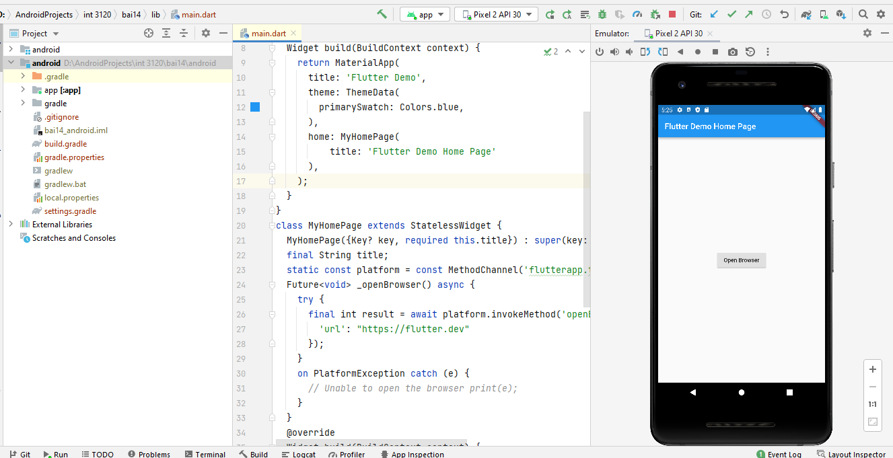
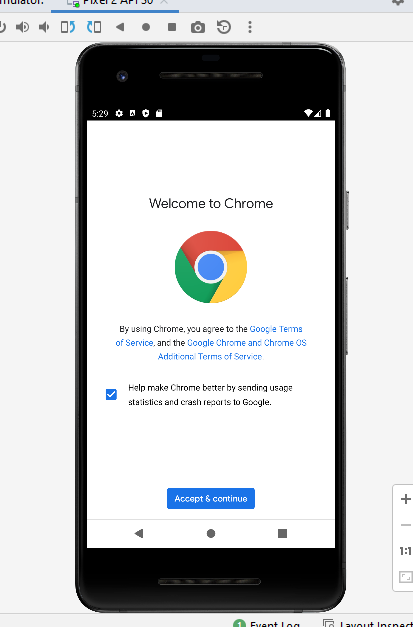
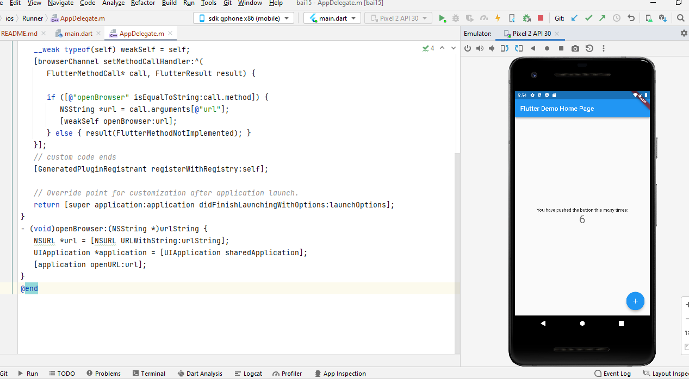
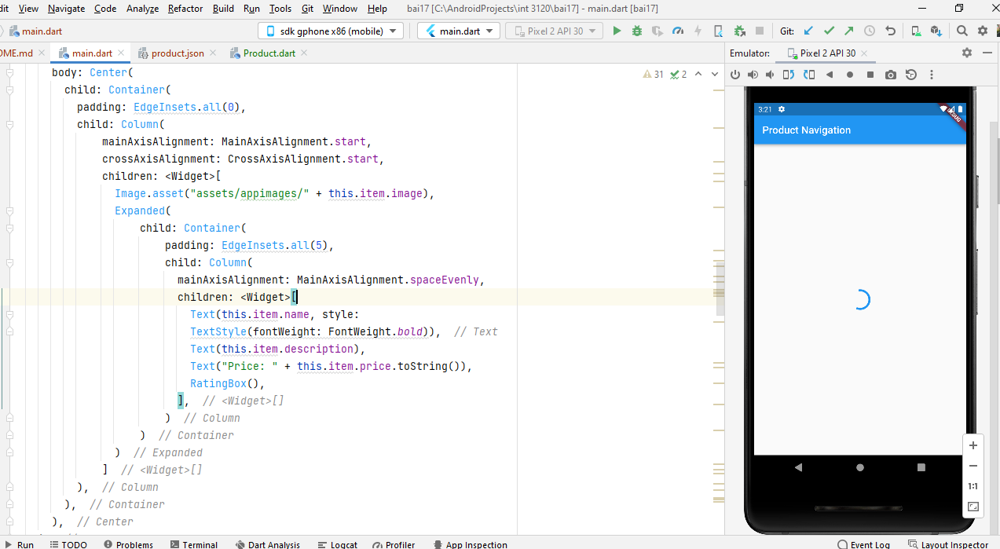
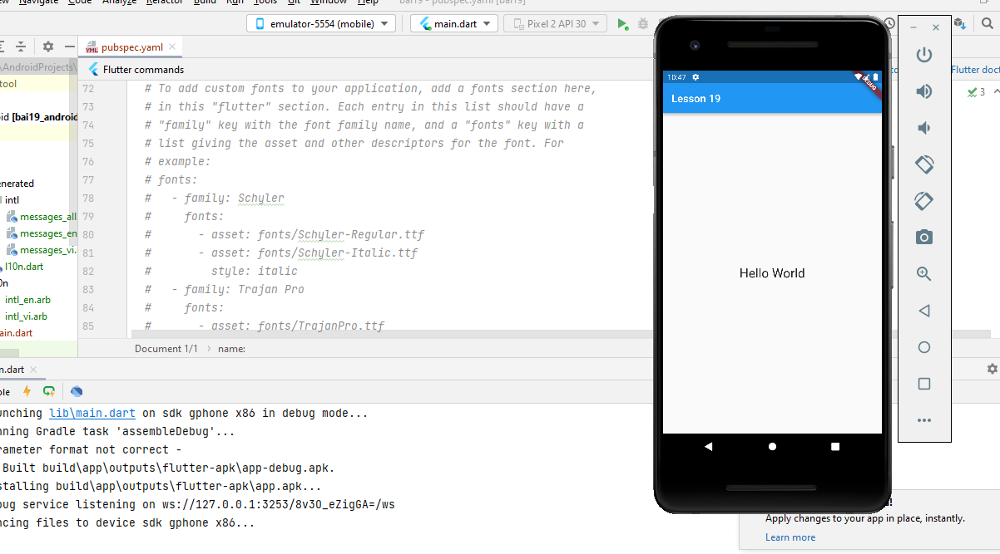

# file bài tập nằm trong /lib
Tuần 1 đã chạy code đến hết bài 13(Animation)

Bài 1,2: 
Cài đặt Flutter, môi trường, IDE
Bài 3:
Ứng dụng HelloWorld

=======

Bài 4: 
- Flutter có các widget, widget là đơn vị thành phần của một chương trình. 
- Flutter hỗ trợ các widget khác nhau như Stateful widget, ...
Bài 5:
- Ngôn ngữ Dart được phát triển bởi google
- Là ngôn ngữ hướng đối tượng như java, cú pháp C (C++)
- Cấu trúc tương tự java
Bài 6:
- Widget là đơn vị cấu thành chương trình trong flutter
- Widget chia thành 4 nhóm:
    + Platform widgets: Các widget đặc thù theo nền tảng. Được thế kế theo các triết lý khác nhau, Material widgets thiết kế theo Material design guideline và Cupertino widgets được thiết kế theo Human Interface Guidelines
    + Layout widgets: Các widget dùng để bố trí giao diện
    + State maintenance widgets: Các widget quản lý state
    + Platform independent / basic widgets: Các widget cơ bản độc lập với nền tảng sử dụng 
    Ví dụ load image: 
    

Bài 7: Layout
      Layout trong Flutter chia làm 2 loại chính: 
        + Single Child Widget: có 1 widget con
        + Multiple CHild Widget: có nhiều widget con
  Ví dụ sử dụng layout: 
  

Bài 8: Gesture
      Gesture trong Flutter là widget giúp xử lý sự kiện như nhấn, kéo, trượt,...
      Ví dụ :
   

Bài 9: State
    State trong Flutter quản lý trạng thái của ứng dụng. State chua làm 2 loại: ngắn hạn và dài hạn
Bài 10:  Stateful widget
    StatefulWidget là class cha của khá nhiều class con dùng để duy trì trạng thái của ứng dụng.
Ứng dụng mẫu từ tài liệu: khi chạy cần chạy lệnh sau trong terminal : flutter run --no-sound-null-safety
    

    
Bài 11: ScopedModel trong Flutter
    Flutter hỗ trợ ScopedModel trong việc quản lý trạng thái ứng dụng. Package gồm 3 class chính:
Model- đóng gói trạng thái của ứng dụng. ScopedModel - widget chuyển đổi dữ liệu từ widget cha xuống widget con khi model cập nhật
. ScopedModelDescendant- widget giúp lấy dữ liệu từ lớp cha khi dât model thây đổi

Bài 12: Navigator và Routing
Flutter cung cấp cho chúng ta lớp routing cơ bản là MaterialPageRoute cùng với hai phương thức Navigator.push() và Navigator.pop()
Ứng dụng flutter mẫu trong tài liệu: bấm vào hình ảnh để chuyển sang mànn hình chi tiết:
    

Bài 13: Animation
Flutter animation dựa trên các đối tượng animation.
Ứng dụng mẫu trong tài liệu: 

#############################

Bài 14: Code với native Android
Flutter cung cấp framework chung để truy cập vào các nền tảng có tính năng riêng biệt thông qua giao thức đơn giản là
Message Channel. Client sẽ gửi thông báo đến Host thông qua Message Channel. Host sẽ lắng nghe từ Message
Channel, nhận thông báo và xử lý các hàm cần thiết và cuối cùng trả kết quả về cho Clients thông qua
Message Channel.

Ứng dụng mẫu trong tài liệu: 

#############################
Bài 15: Code với Specific IOS
Truy cập nền tảng IOS cũng giống như Android nhưng sử dụng Objective-C hoặc Swift
Ứng dụng mẫu:

Bài 16: Package
Dart tổ chức và chia sẻ các chức năng thông qua package. Dart package cũng giống như Dart Application ngoại trừ Dart
Package không truy cập vào các điểm chính của ứng dụng.
Các kiểu package: Flutter package, Dart package, Flutter plugin.
#############################
Bài 17: Truy cập API REST
Flutter cung cấp gói http để tiêu thụ tài nguyên HTTP. http là một thư viện dựa trên Tương lai và sử dụng các 
tính năng await và async. Nó cung cấp nhiều phương pháp cấp cao và đơn giản hóa việc phát triển các ứng dụng 
di động dựa trên REST.

Ứng dụng mẫu: chạy bằng lệnh : flutter run --no-sound-null-safety

Bài 18: CSDL
Flutter cung cấp nhiều gói nâng cao để làm việc với cơ sở dữ liệu. Các gói quan trọng nhất là
    + sqflite - Được sử dụng để truy cập và thao tác với cơ sở dữ liệu SQLite
    + firebase_database - Được sử dụng để truy cập và thao tác với cơ sở dữ liệu NoSQL được lưu trữ trên đám mây từ Google.

Bài 19: Internationalization
Ngày nay, các ứng dụng di động được sử dụng bởi khách hàng từ các quốc gia khác nhau và do đó, các ứng dụng được yêu cầu hiển
thị nội dung bằng các ngôn ngữ khác nhau. Việc cho phép ứng dụng hoạt động bằng nhiều ngôn ngữ được gọi là Internationalization (Chuyển đổi ngôn ngữ).
